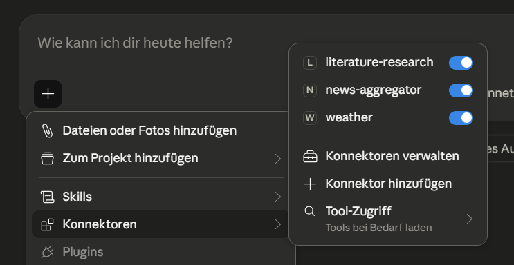

# MCP Server

This project implements a Model Context Protocol (MCP) server that provides useful tools for:

- Academic literature search (arXiv)
- News aggregation
- Weather information

It is designed to be used with Claude Desktop as an MCP client.

### literature
Searches the arXiv database for relevant papers on a given topic, 
returning the title, URL, and authors of each result useful for 
systematic literature reviews.

### news_aggregator
The news_aggregator provides a list of breaking news from popular sources such as tagesschau, BBC News, DW world, heise online, Spiegel Online and New York Times about a specific topic. 

### weather 
The weather provides temperature, wind's speed and direction and detailed forecast about the weather in specified city.

## How to configure

### Install claude desktop
In this project, Claude Desktop is used as an MCP-Client. Therefore, some configuration are required. 

### Add a claude desktop config file 
Go to claude desktop open settings and add or configure a 'claude_desktop_config' file.

## Overview.
Example of the available tools in Claude Desktop:
 

## Installation

#### Prerequisites

Make sure you have the following installed:

- uv
- A recent version of python (requires-python = ">=3.12")

#### Clone the repository
```bash
git clone https://github.com/your-username/mcp-server.git
```
```bash
cd mcp-server
```
#### Create virtual environment & install dependencies
```bash
uv venv
uv sync
```

#### Configure Claude Desktop
To use this MCP server with Claude Desktop:

- Open Claude Desktop
- Go to Settings
- Locate or create the claude_desktop_config file
- Add your MCP server configuration `claude_desktop_config` (example):
```bash
{
  "mcpServers": {
    "literature-research": {
      "command": "uv",
      "args": [
        "--directory",
        "C:...",
        "run",
        "python",
        "literature.py"
      ]
    },
  }
}
```

#### Verify installation

After starting the server and configuring Claude Desktop:

Open Claude Desktop
Check if the tools (literature, news_aggregator, weather) are available